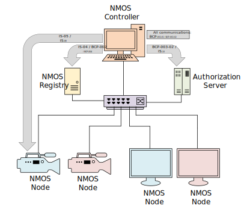

# NMOS Controller Implementation Guide

## Scope

This document is intended as a guide for implementers or users of Controllers within NMOS-enabled networked media systems.
The document defines what a Controller is and outlines the requirements of a Controller with respect to each existing NMOS specification through references to the relevant sections of those documents.

The document focuses primarily on guidance for the following NMOS specifications:
* IS-04
* IS-05
* BCP-003-01

However, this is a living document and it is intended that fuller guidance for other NMOS specifications be added in future.

## Use of Normative Language

This document is a guide to Controllers only and not a specification itself. It provides informational guidance around the normative requirements of the relevant specifications.
If there are any inconsistencies between this guide and the specifications then, unequivocally, the specification is correct
Any conformance language key words found in this document are not to be interpreted as RFC 2119 key words.

## Controller Definition

A Controller is Client software that interacts with the NMOS APIs to discover, connect and manage resources (Nodes, Devices, Senders and Receivers) within a networked media system.
The diagram below shows some of those API interactions with other NMOS system components.

* This document covers how the Controller interacts with the NMOS APIs only.
  It does not cover other features of the Controller software, such as presentation.
* This document does not cover any requirements relating to where a Controller is additionally acting as a Node (e.g. receiving monitoring information via IS-07).

Where this document refers to a User, this can include both human operators who drive a Controller manually and automation systems that drive a Controller programmatically.

## Controller Interactions

The sections below describe how Controllers interact with the NMOS suite of Interface Specifications (IS) and Best Current Practice (BCP) recommendations, with references to the relevant parts of these specifications where the normative language can be found. They also include some additional informative guidance to implementers of Controllers.

### Notes on Understanding the AMWA NMOS Specifications

All of the specifications referenced below can be accessed from the [AMWA NMOS](https://specs.amwa.tv/nmos/) website.

As well as reading the text of the specifications, a fuller understanding of the described API can be achieved by paying particular attention to the API section (for instance, the [IS-04 Query API](https://specs.amwa.tv/is-04/releases/v1.3.2/APIs/QueryAPI.html)).

APIs can be investigated by clicking on the HTTP methods for each endpoint listed (click [here](https://specs.amwa.tv/is-04/releases/v1.3.2/APIs/QueryAPI.html#senders_get) for an example).
This will open a window with a description of the Request and Response for that HTTP method.

These, along with the provided JSON schemas and examples, often contain canonical definitions not described in the supporting text.

Similarly be aware of the [NMOS Parameter Registers](https://specs.amwa.tv/nmos-parameter-registers/) as this contains definitions used by many of the specifications.

### IS-04 Discovery and Registration

> *Controllers use the **IS-04 Query API** to discover and obtain updates on the NMOS resources that are available on the network.*

The IS-04 specification describes the mechanism for the discovery and registration of NMOS resources within a media network. It comprises three APIs: the Registration API, the Query API and the Node API. A brief summary of each API is given below.

The **IS-04 Registration API** is exposed by the Registry. When a Node first joins the network, it uses [unicast DNS-SD](https://specs.amwa.tv/info-004) or multicast DNS-SD (mDNS) to discover the URL of the Registration API. It then uses the Registration API to register information about itself and all its sub-resources (Devices, Senders, Receivers, Sources and Flows). Each Node then communicates with the Registration API with a regular heartbeat message to let the Registry know that it is still on the network. Nodes also use the Registration API to update the information about themselves in the Registry whenever something changes.

The **IS-04 Query API** is also exposed by the Registry. Controllers discover the URL of the Query API using unicast DNS-SD (or mDNS) and then obtain an up-to-date list of all registered Nodes and sub-resources (Devices, Senders, Receivers, Sources and Flows) so that they can indicate to the User the currently available resources on the network. Controllers also use the Query API to set up WebSocket subscriptions to resources, so that they obtain updates every time something changes in the Registry.

The **IS-04 Node API** is exposed by Nodes. It is used by Controllers or other Nodes to discover information about a Node directly when there is no Registry available on the network (in peer-to-peer mode).

The IS-04 specification describes the requirements for Controllers in the document entitled [Controllers](https://specs.amwa.tv/is-04/releases/v1.3.2/docs/Controllers.html).

### IS-05 Device Connection Management

> *Controllers use the **IS-05 Connection API** to make connections between Senders and Receivers.*

Nodes on a media network can provide any number of Devices, each of which can have any number of Senders and Receivers. The IS-05 specification describes the mechanism for making connections between Senders and Receivers.

The **IS-05 Connection API** is exposed by NMOS Devices. Controllers discover the URL of the Connection API through the list of `controls` for the Device. This is part of the information that will have been registered to the IS-04 Registry by the Device's parent Node. It is available to the Controller by querying the Registry using the IS-04 Query API and examining the information returned about the Device in question.

Controllers make connections between Senders and Receivers by making requests to the Connection APIs of their parent Devices.

As an example, for RTP-based connections this involves the following two steps. The Controller first calls the Connection API for the Sender to update its transport parameters if necessary and then obtain its transport file. It then calls the Connection API for the Receiver to provide it with the transport file and complete the connection.

Note that some other types of connection such as WebSocket or MQTT follow a similar pattern but do not use transport files.

The IS-05 specification describes the requirements for Controllers in the document entitled [Controllers](https://specs.amwa.tv/is-05/releases/v1.1.2/docs/Controllers.html).

### IS-07 Event and Tally

> *Controllers are able to identify **IS-07** Senders and Receivers in the **IS-04** Registry and make connections between them using **IS-05**.*

### IS-08 Audio Channel Mapping

> *Controllers use the **IS-08 Channel Mapping API** to indicate the current mapping of audio channel inputs to outputs within a device and allow a User of the Controller to modify these.*

### IS-09 System Parameters

> *Controllers use the **IS-09 System API** to obtain information about the location of system logging servers to which they are able to post their logs.*

### IS-10 Authorization

> *Controllers use the **IS-10 Authorization API** to enable them to make authorized calls to all other APIs.*

### BCP-002-01 Natural Grouping

> *Controllers use the **BCP-002-01 Natural Grouping** best current practice recommendations to allow them to understand associations between logical groups of NMOS Senders or Receivers.*

### BCP-003-01 Secure Communication in NMOS Systems

> *Controllers use the **BCP-003-01 Secure Communication in NMOS Systems** best current practice recommendations to protect the API calls that they make with transport layer security.*

The NMOS APIs use the HTTP and WebSocket protocols to exchange information between different components of a media network. However, unless a method of securing these communications is used, all information exchanged using the NMOS APIs is sent as plaintext. This means there is a risk that the information is intercepted and read by a third party. It is even possible that the information is modified without the knowledge of the original communicating parties. These types of person-in-the-middle attacks can be prevented by using standard IT best practices to ensure that the communication channel is secure.

The BCP-003-01 document specifies which standard IT best practices to use. By listing specific practices which all BCP-003-01 compliant NMOS implementations follow, it ensures interoperability between products from different vendors.

In particular, the document specifies the Transport Layer Security (TLS) versions and cipher suites to use for all NMOS HTTP and WebSocket communications. It additionally sets out the specific behaviour that is expected from the two communicating parties (the API server and API client).

To aid implementers, requirements that are specific to Controllers have been set out in the [Controllers](https://specs.amwa.tv/bcp-003-01/releases/v1.0.1/docs/Controllers.html) section of the BCP-003-01 document.

### BCP-003-02 Authorization in NMOS Systems

> *Controllers use the **BCP-003-02 Authorization in NMOS Systems** best current practice recommendations to ensure they meet the authorization requirements of the endpoints to which they are making API calls.*

### BCP-003-03 Certificate Provisioning in NMOS Systems

> *Controllers use the **BCP-003-03 Certificate Provisioning in NMOS Systems** best current practice recommendations to obtain and refresh Client certificates for **BCP-003-01** transport layer security.*

### BCP-004-01 Receiver Capabilities

> *Controllers use the **BCP-004-01 Receiver Capabilities** best current practice recommendations to determine whether a Receiver is capable of receiving a Flow from a Sender.*
